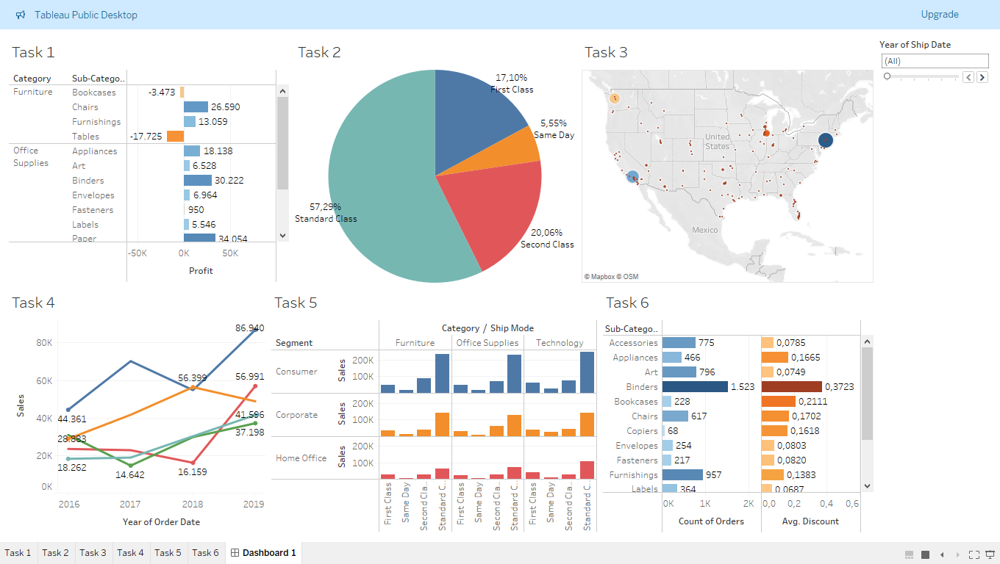

# Tableau Sales Dashboard

Interactive Tableau dashboard analyzing retail sales performance, customer segments, shipping modes, and geographic distribution.

---

## Overview
This project presents an interactive Tableau dashboard built to explore sales data and extract business insights.  
The analysis focuses on identifying profitable categories, understanding customer segments, evaluating shipping performance, and visualizing geographic sales distribution.

The dashboard was designed with a business-oriented approach, simulating a real-world reporting scenario for decision-making.

---

## Objectives
- Analyze sales performance across product categories  
- Compare customer segments and their contribution to revenue  
- Examine shipping modes and their impact on performance  
- Visualize geographic distribution of sales  
- Build an interactive dashboard suitable for business reporting  

---

## Tools Used
- Tableau Public  
- Data visualization techniques  
- Interactive dashboard design  
- Business-oriented KPI exploration  

---

## Repository Structure

---

## How to Use
1. Download the `.twbx` file  
2. Open it with Tableau Public or Tableau Desktop  
3. Explore filters and visuals to interact with the dashboard  

---

## Dashboard Preview

---

## Skills Demonstrated
- Data visualization  
- Dashboard design  
- Business insight extraction  
- KPI interpretation  
- Interactive reporting  

---

## Author
Zacharias Pasparakis
